# MessageAI - Architecture Documentation

This document provides visual diagrams of the MessageAI system architecture, showing how all components interact.

---

## Complete System Architecture

```mermaid
graph TB
    subgraph "Client - React Native App"
        subgraph "UI Layer"
            UI[UI Components<br/>React Native Paper]
            Screens[Screens<br/>Expo Router]
            CustomUI[Custom UI Library<br/>Button, Input, Avatar, etc.]
        end
        
        subgraph "State Management"
            AuthStore[AuthStore<br/>Zustand]
            ChatStore[ChatStore<br/>Zustand]
            ContactStore[ContactStore<br/>Zustand]
            GroupStore[GroupStore<br/>Zustand]
        end
        
        subgraph "Business Logic"
            Hooks[Custom Hooks<br/>useAuth, useMessages, etc.]
            Services[Service Layer]
        end
        
        subgraph "Local Storage"
            SQLite[(SQLite Database<br/>Users, Chats, Messages<br/>Scroll Positions, Queue)]
            AsyncStorage[(AsyncStorage<br/>Theme, Preferences)]
        end
        
        subgraph "Firebase Services Layer"
            AuthService[AuthService<br/>Sign In/Up, Google Auth]
            ChatService[ChatService<br/>CRUD Operations]
            MessageService[MessageService<br/>Send, Receive, Status]
            UserService[UserService<br/>Profile Management]
            StorageService[StorageService<br/>Image Upload]
            PresenceService[PresenceService<br/>Online Status, Typing]
            GroupService[GroupService<br/>Group Operations]
            MessagingService[MessagingService<br/>Push Notifications]
        end
    end
    
    subgraph "Backend - Firebase"
        subgraph "Firebase Auth"
            EmailAuth[Email/Password Auth]
            GoogleAuth[Google Sign-In]
        end
        
        subgraph "Firestore Collections"
            Users[/users/{userId}/<br/>Profile, Status, FCM Token]
            Chats[/chats/{chatId}/<br/>Participants, Last Message]
            Messages[/chats/{chatId}/messages/<br/>Text, Images, Status]
            Participants[/chats/{chatId}/participants/<br/>Roles, Read Status]
            FriendRequests[/friendRequests/<br/>Pending, Accepted]
            BlockedUsers[/users/{userId}/blockedUsers/<br/>Blocked List]
            Typing[/chats/{chatId}/typing/<br/>Real-time Typing]
        end
        
        subgraph "Firebase Storage"
            ProfilePics[/users/{userId}/profile.jpg]
            GroupIcons[/groups/{chatId}/icon.jpg]
            MessageImages[/chats/{chatId}/{messageId}/<br/>image.jpg, thumbnail.jpg]
        end
        
        subgraph "Firebase Cloud Messaging"
            FCM[FCM Service<br/>Push Notifications]
        end
        
        subgraph "Firebase Functions"
            CloudFunctions[Cloud Functions<br/>Future: AI Translation]
        end
    end
    
    subgraph "External Services"
        GoogleSignIn[Google Sign-In API]
        AppStore[App Store / Play Store<br/>Distribution]
    end
    
    %% UI Connections
    UI --> Screens
    Screens --> CustomUI
    Screens --> Hooks
    
    %% State Management Connections
    Hooks --> AuthStore
    Hooks --> ChatStore
    Hooks --> ContactStore
    Hooks --> GroupStore
    
    %% Local Storage Connections
    AuthStore --> SQLite
    ChatStore --> SQLite
    ContactStore --> SQLite
    GroupStore --> SQLite
    AuthStore --> AsyncStorage
    
    %% Service Layer Connections
    Hooks --> Services
    Services --> AuthService
    Services --> ChatService
    Services --> MessageService
    Services --> UserService
    Services --> StorageService
    Services --> PresenceService
    Services --> GroupService
    Services --> MessagingService
    
    %% Firebase Auth Connections
    AuthService --> EmailAuth
    AuthService --> GoogleAuth
    GoogleAuth --> GoogleSignIn
    
    %% Firestore Connections
    AuthService --> Users
    UserService --> Users
    ChatService --> Chats
    MessageService --> Messages
    MessageService --> Participants
    UserService --> FriendRequests
    UserService --> BlockedUsers
    PresenceService --> Users
    PresenceService --> Typing
    GroupService --> Chats
    GroupService --> Participants
    
    %% Storage Connections
    StorageService --> ProfilePics
    StorageService --> GroupIcons
    StorageService --> MessageImages
    
    %% Push Notification Connections
    MessagingService --> FCM
    FCM --> UI
    
    %% Real-time Listeners
    Chats -.Real-time Listener.-> ChatService
    Messages -.Real-time Listener.-> MessageService
    Users -.Real-time Listener.-> PresenceService
    Typing -.Real-time Listener.-> PresenceService
    
    %% Distribution
    UI --> AppStore
    
    style SQLite fill:#e1f5ff
    style AsyncStorage fill:#e1f5ff
    style Users fill:#fff4e1
    style Chats fill:#fff4e1
    style Messages fill:#fff4e1
    style FCM fill:#ffe1e1
    style CloudFunctions fill:#e1ffe1
```

---

## Authentication Flow

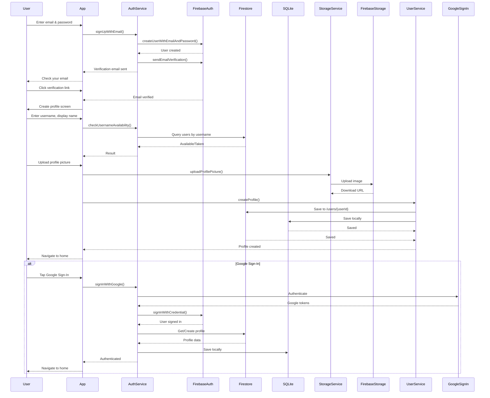

---

## Message Send/Receive Flow

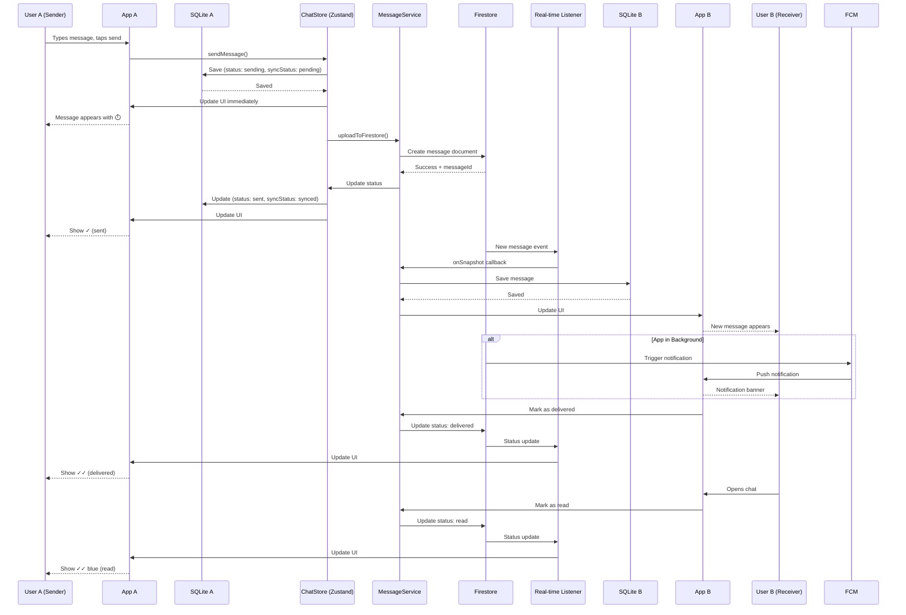

---

## Offline Message Queue Flow

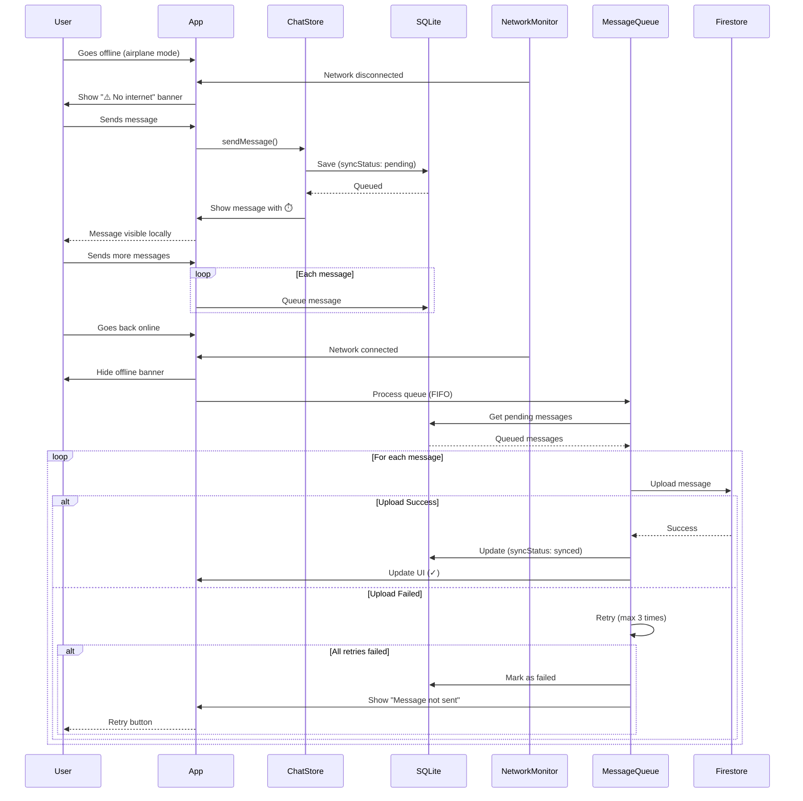

---

## Virtual Scrolling & Message Loading

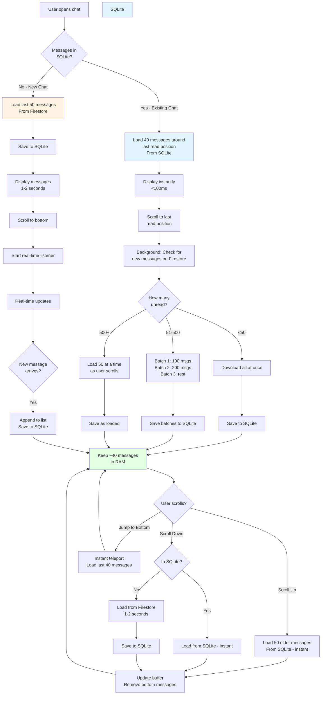

---

## Image Upload & Compression Flow

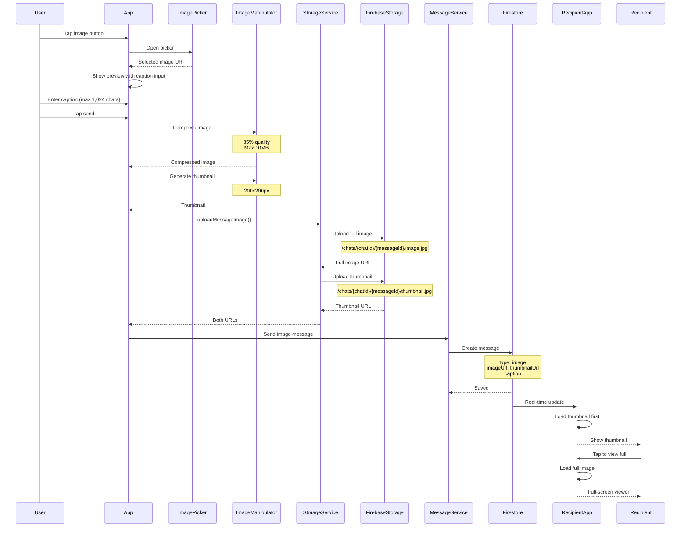

---

## Group Chat & Admin Flow

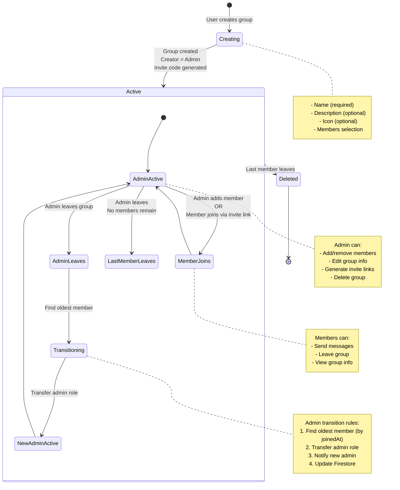

---

## Real-Time Presence & Typing Indicators

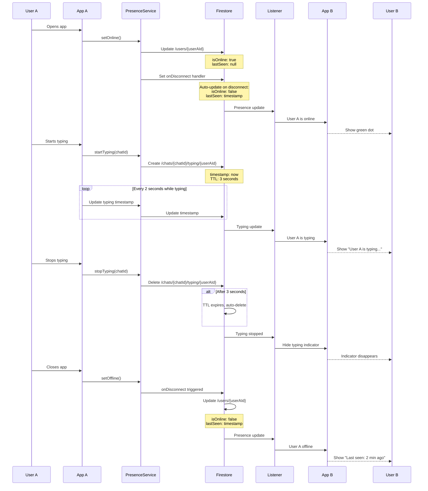

---

## Push Notification Flow

```mermaid
flowchart TD
    Start[App launches] --> RequestPerm{First launch?}
    
    RequestPerm -->|Yes| AskUser[Request notification<br/>permission]
    RequestPerm -->|No| CheckToken[Check FCM token]
    
    AskUser -->|Granted| GetToken[Get FCM token]
    AskUser -->|Denied| NoNotif[App works without<br/>notifications]
    
    GetToken --> SaveToken[Save token to<br/>Firestore /users/{userId}]
    SaveToken --> Listen[Listen for notifications]
    CheckToken --> Listen
    
    Listen --> NotifReceived{Notification<br/>received?}
    
    NotifReceived -->|Foreground| ShowInApp[Display in-app notification]
    NotifReceived -->|Background| ShowSystem[System notification banner]
    
    ShowInApp --> UserTaps1{User taps?}
    ShowSystem --> UserTaps2{User taps?}
    
    UserTaps1 -->|Yes| Navigate[Navigate to chat]
    UserTaps2 -->|Yes| Navigate
    
    Navigate --> OpenChat[Open specific chat<br/>or screen]
    
    subgraph "Notification Types"
        NewMsg[New Message<br/>Show preview if &lt;50 chars]
        ImageMsg[Image Message<br/>'Name sent an image']
        FriendReq[Friend Request<br/>'New request from Name']
        ReqAccept[Request Accepted<br/>'Name accepted your request']
        AddedGroup[Added to Group<br/>'Name added you to Group']
    end
    
    NotifReceived -.Type.-> NewMsg
    NotifReceived -.Type.-> ImageMsg
    NotifReceived -.Type.-> FriendReq
    NotifReceived -.Type.-> ReqAccept
    NotifReceived -.Type.-> AddedGroup
    
    style GetToken fill:#e1f5ff
    style ShowInApp fill:#ffe1e1
    style ShowSystem fill:#ffe1e1
    style Navigate fill:#e1ffe1
```

---

## Technology Stack Summary

```mermaid
graph LR
    subgraph "Frontend"
        RN[React Native 0.81.4]
        Expo[Expo SDK 54]
        TS[TypeScript 5.9]
        Router[Expo Router]
        Paper[React Native Paper]
        FlashList[@shopify/flash-list]
        Zustand[Zustand State]
        DateFns[date-fns]
    end
    
    subgraph "Local Storage"
        SQL[Expo SQLite]
        Async[AsyncStorage]
    end
    
    subgraph "Firebase"
        FAuth[Firebase Auth]
        FStore[Firestore]
        FStorage[Firebase Storage]
        FFCM[Firebase Cloud Messaging]
        FFunctions[Cloud Functions<br/>Future]
    end
    
    subgraph "External APIs"
        Google[Google Sign-In API]
    end
    
    subgraph "Development"
        Jest[Jest Testing]
        ESLint[ESLint]
        Prettier[Prettier]
    end
    
    RN --> Expo
    Expo --> TS
    Expo --> Router
    RN --> Paper
    RN --> FlashList
    RN --> Zustand
    RN --> DateFns
    
    RN --> SQL
    RN --> Async
    
    RN --> FAuth
    RN --> FStore
    RN --> FStorage
    RN --> FFCM
    
    FAuth --> Google
    
    style RN fill:#61dafb
    style Expo fill:#000020
    style FStore fill:#ffca28
    style FAuth fill:#ffca28
    style SQL fill:#e1f5ff
```

---

## Data Sync Strategy

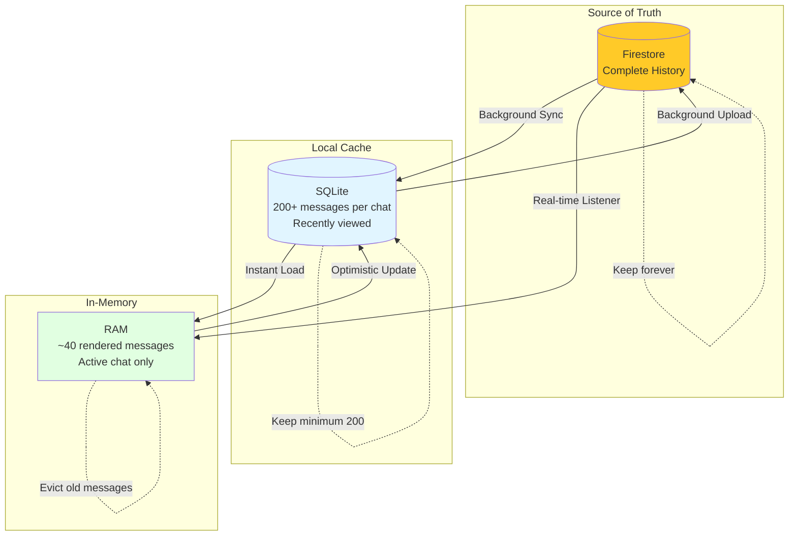

---

## Friend Request & Contact Flow

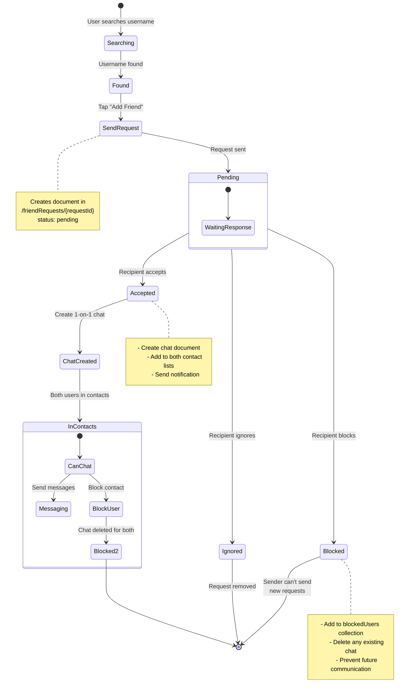

---

## Performance Optimization Strategy

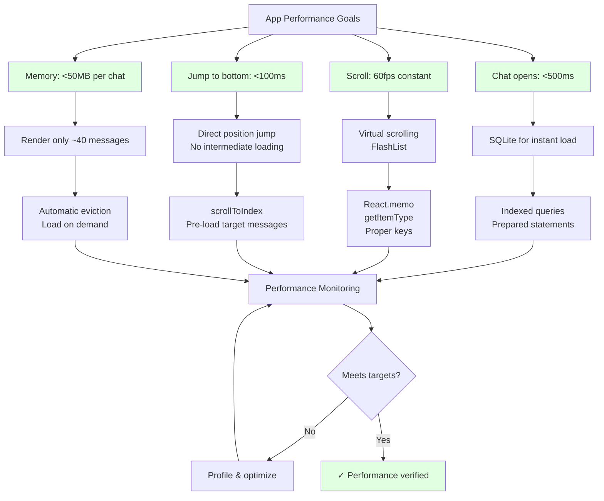

---

## Security & Privacy Architecture

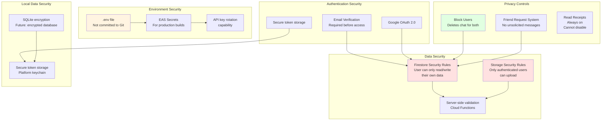

---

## Deployment Pipeline

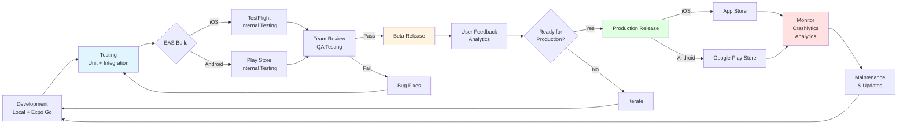

---

## Future: AI Translation Architecture (Post-MVP)

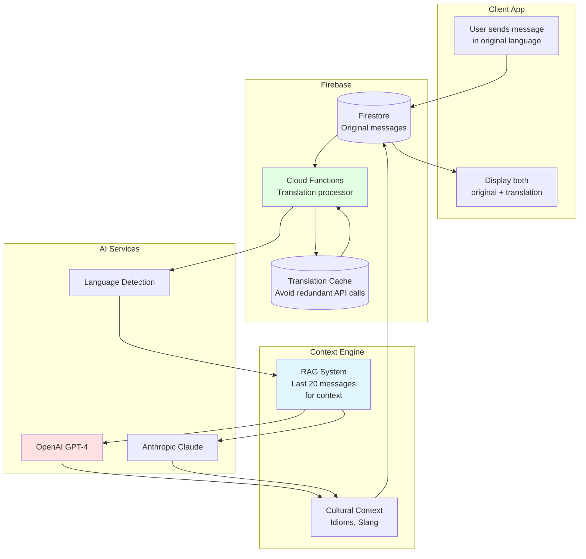

---

## Comprehensive Interaction Summary

| Component | Technology | Purpose | Connects To |
|-----------|-----------|---------|-------------|
| **UI Layer** | React Native + Expo Router | User interface | State stores, hooks |
| **State Management** | Zustand | Global state | Services, SQLite |
| **Local Database** | Expo SQLite | Offline storage, cache | All stores |
| **Firebase Auth** | Firebase Auth SDK | Authentication | Firestore, Google |
| **Firestore** | NoSQL Database | Real-time data | All Firebase services |
| **Storage** | Firebase Storage | File storage | Firestore (URLs) |
| **Notifications** | FCM | Push alerts | Firestore triggers |
| **Real-time** | Firestore Listeners | Live updates | All collections |
| **Image Handling** | Expo Image Manipulator | Compression, thumbnails | Firebase Storage |
| **Virtual Scroll** | FlashList | Performance | SQLite, State |

---

*This architecture is designed for scalability, performance, and a seamless user experience. All components work together to provide real-time messaging with robust offline support.*

